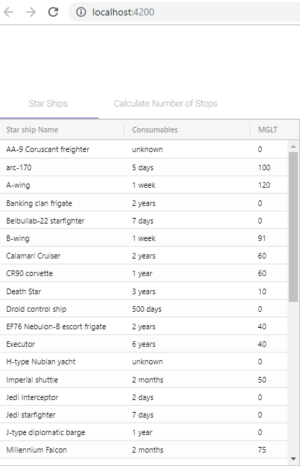

# SWStarhips
We want to know for all SW star ships, to cover a given distance, how many stops for resupply are required.

The application will take as input a distance in mega lights (MGLT).

The output should be a collection of all the star ships and the total amount of stops required to make the distance between the planets.

## Getting Started

This project has two ways to execute and see the result. 
1) Executing a .exe that will run and show the result in a console prompt (made in .Net).
2) Executing a website that will run in your browser (made the backend in .Net and the frontend in Angular).

### Run by Console 
Open the CMD and go to the project folder: \SWStarships\SWStarshipsConsole
Run the command to execute the project
```
dotnet run --SWStarshipsConsole SWStarshipsConsole.csproj
```

### Run by Browser
Install dependencies with
```
npm install
```
Execute the server with
```
npm start
```
The Server will run at 
```
http://localhost:4200/
```

Execute the Rest Service
Open the CMD (execute as Admin) and go to the project folder: \SWStarships\SWStarshipsRest
Run the command to execute the project
```
dotnet run --SWStarshipsRest SWStarshipsRest.csproj
```
The Rest Service will run at 
```
http://localhost:62300/
```
*Rest Service Running


*Front Service Running



## Running the tests

There are unit test for the backend codes.
They can run at \SWStarships\UnitTestStarship

These unit test cover all the services of the used in the project.

## Coding style

The solution was divided in 6 small projects.

*  StarWarsAPI: This project contain the integration with the SWAPI.
*  SWStarships: This is the main project. It contain all the bussiness layer, the access in the repositories. It used the ServiceProvider of .NetCore to control the injection dependency.
*  UnitTestStarship: This project contain the unit test of the solution. It tests mostly the Bussiness Service Layer.
*  SWStarshipsConsole: This project is the executable to run the console application. It uses the SWStarships services to show the results.
*  SWStarshipsRest: This project is the Rest Service to use in the Website. It uses the SWStarships services to return the results.
*  FrontEnd/starshipApp: It is a Simple Angular project. It calls the SWStarshipsRest to obtain the results and show in the website.
